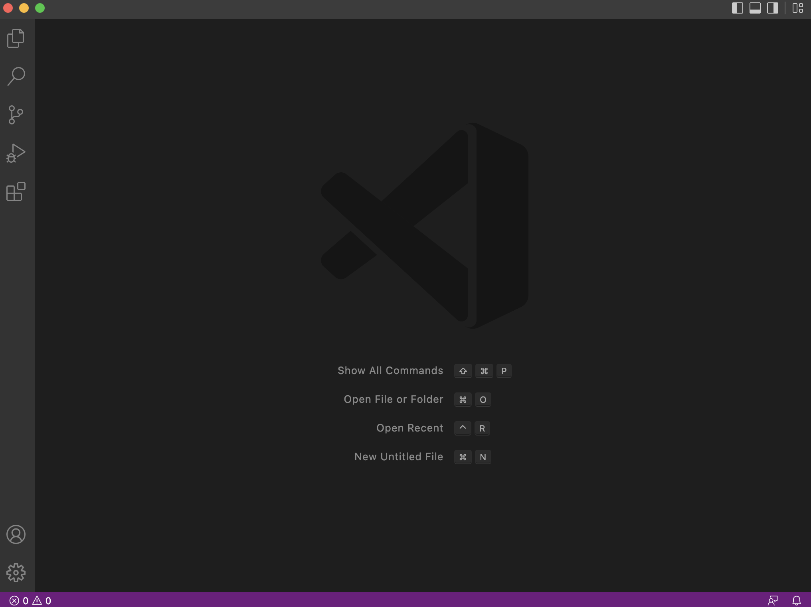
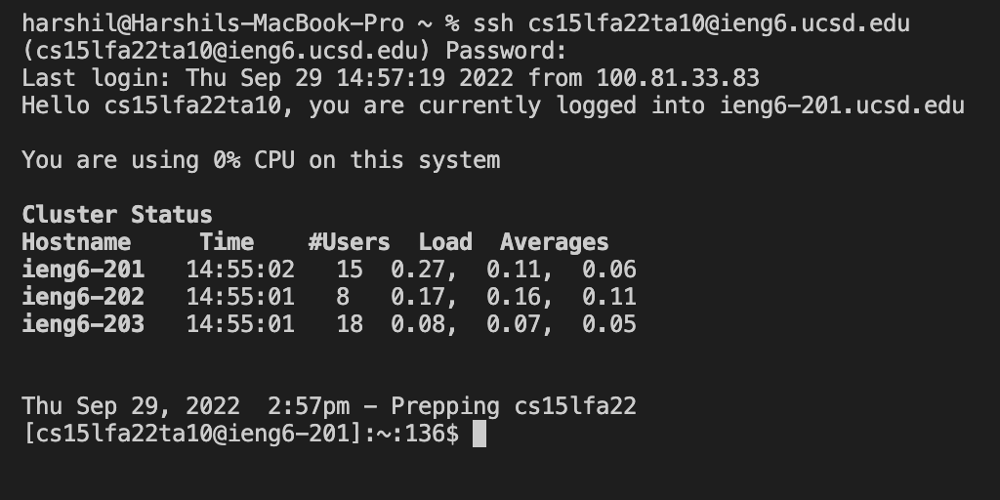
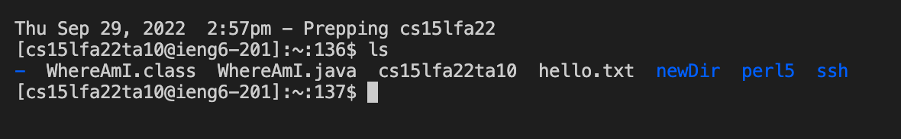
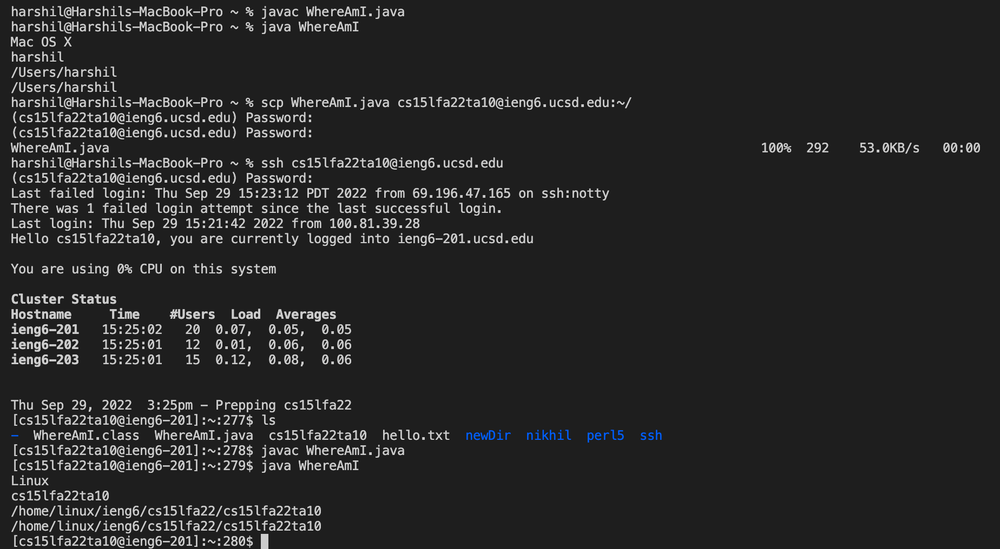
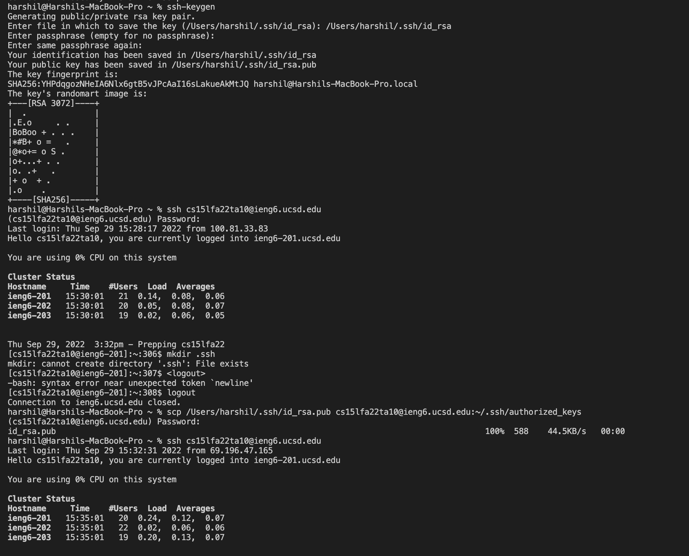
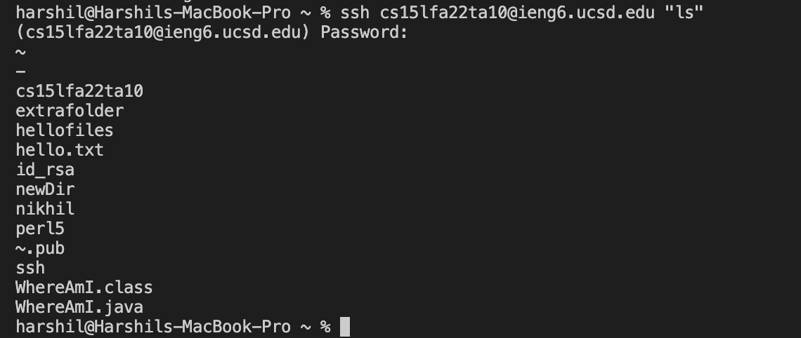

# Week 1 Lab Report

In this lab, we will be talking about setting up VSCode and Remote Connecting to the UCSD Computers. This process has been divided into six steps which will help enhance your understadning of the concepts


## Step 1 - Installing VSCode


You will be installing VSCode to access the terminal to remotely connect to ieng6, the UCSD Computer. For that access the website following website -


[https://code.visualstudio.com/](https://code.visualstudio.com/)


Complete all the setup steps to install VSCode. You should see the following screen after the installation process is complete -





## Step 2 - Remotely Connecting


Launch the terminal in VSCode. To remotely connect, you must begin by typing the following - 


`ssh cs15lfa22<your last two alphabets here - in my case mz>@ieng6.ucsd.edu`


Entering this will prompt you for your password. Enter the password (you wont be able to see what youre typing in so be careful). If the process is successful, you should get this message - 





## Step 3 - Trying some commands


We have successfully connected to ieng6! Now its time to try out some commands. I cannot connect to my account yet, so I am using the screenshots from the class. I tried out the ls code and it listed files on the UCSD Computer. You can try out other stuff as well!





## Step 4 - Moving files with scp


Here we will discuss how to upload files from your device on the external computer. For that we need to use the code scp.


`scp <File Name> cs15lfa22<your username last 2>@ieng6.ucsd.edu:~/`


This uploads the file online. However, you will not be logged in. First log in and then see the file you uploaded using the ls command.





## Step 5 - Setting an SSH key


Entering your password every singl time you log in or scp a file from your device to the external device can get tedious. To make that process easier, we will talk about SSH keys. This process will save the password on your device and bypass the password entering steps.


```
harshil@Harshils-MacBook-Pro ~ % ssh-keygen
Generating public/private rsa key pair.
Enter file in which to save the key (Enter your own location --->) (/Users/harshil/.ssh/id_rsa):/Users/harshil/.ssh/id_rsa
Enter passphrase (empty for no passphrase):
Enter same passphrase again:
Your identification has been saved in /Users/harshil/.ssh/id_rsa
Your public kev has been saved in /Users/harshil/.ssh/id_rsa.pub
The key fingerprintiS:
SHA256: YHPdqgozNHeIA6N4x6gtB5vJPcAaI16sLakueAkMtJQ harshil@arshils-MacBook-Pro.local
```

Typing this will create a key on your device. Now, we will have to generate a similar structure on the server.


After logging into your account through ssh, type in the following - 


`mkdir .ssh`


Then logout from the server and type the following on your device


`scp (Location of your ssh file) ---> (/Users/harshil/.ssh/id_rsa.pub) cs15lfa22@ieng6.ucsd.edu:~/.ssh/authorized_keys`


This completes the process. Now you should be able to log in to the server without entering the password every time. A sample image has been provided below.





## Step 6 - Optimizing Remote Running


Now we will try speeding up the process through some small "tricks". One of these tricks includes writing the command in quotes at the end of the ssh to run it directly after launching.





This is one way to speed up the process. Another way includes using semicolon to connect commands that you would usually write in different lines. 


---


This concludes the lab report.


