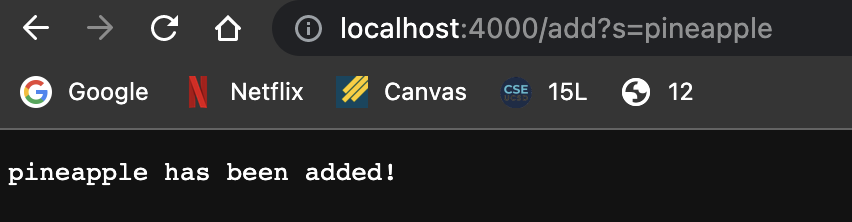
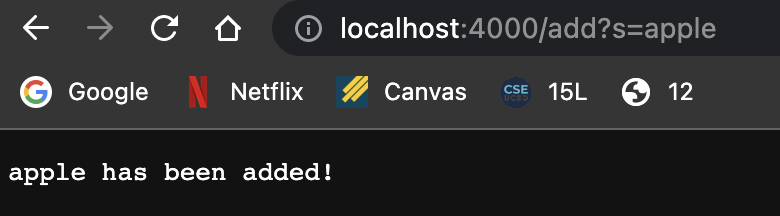
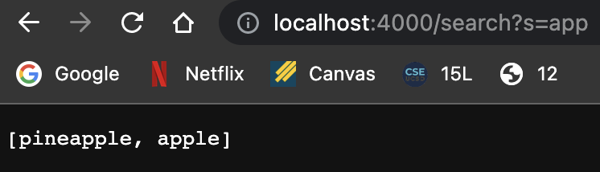
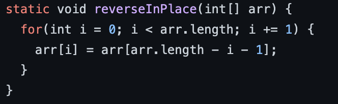
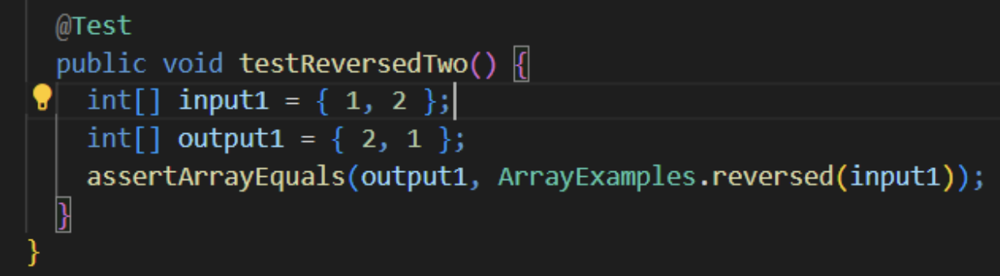
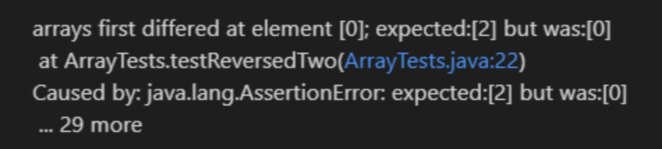
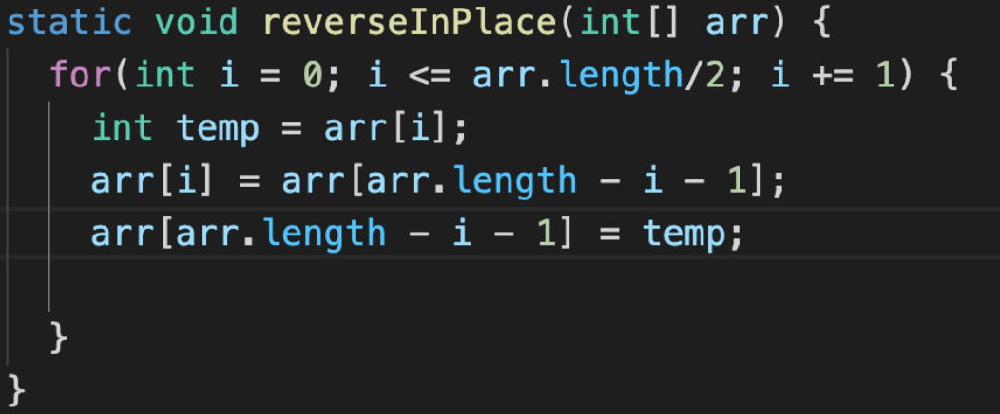
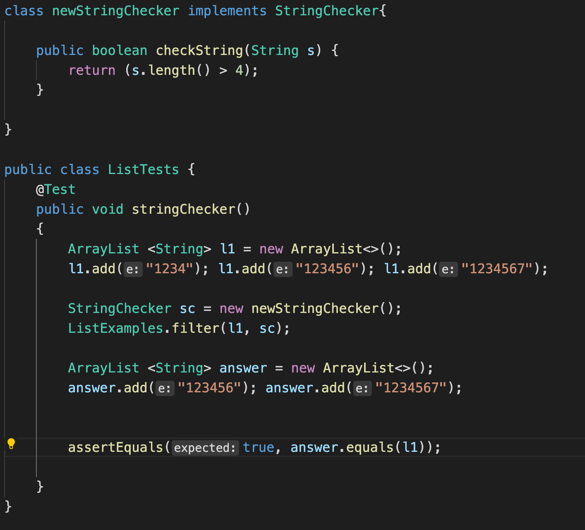
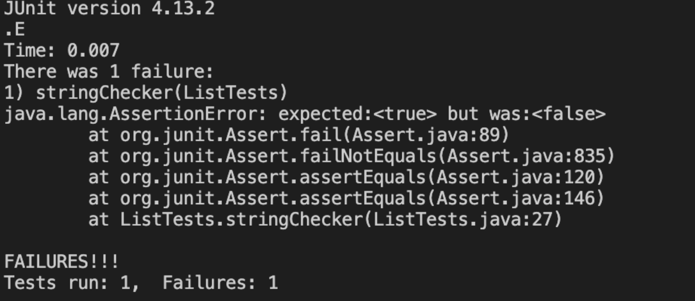
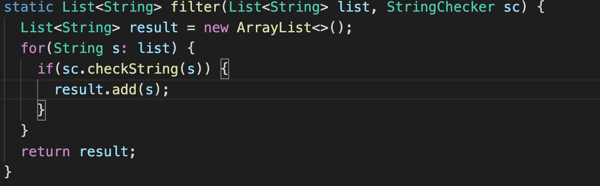

# Week 3 Lab Report


## Part 1 - Search Engine


The code for the Search Engine is:

```
import java.io.IOException;
import java.net.URI;
import java.util.ArrayList;


class SearchEngineMaker implements URLHandler
{
    ArrayList<String> added = new ArrayList<>();
    ArrayList<String> result= new ArrayList<>();
    public String handleRequest (URI url)
    {
        
        if (url.getPath().contains("/add")) 
        {
            String[] parameters = url.getQuery().split("=");
            if (parameters[0].equals("s"))
            {
            added.add(parameters[1]);
            return String.format("%b has been added!", parameters[1]);
            }
        }
        
        if (url.getPath().contains("/search")){
            String[] parameters = url.getQuery().split("=");
            
            if (parameters[0].equals("s"))
            {
                for (int i = 0; i < added.size(); i++)
                {
                    if (added.get(i).contains(parameters[1]))
                    {
                        result.add(added.get(i));
                    }
                }
                return result.toString();
            }  
        }

        return null;

    }
}

class SearchEngine
{
    public static void main(String[] args) throws IOException{
        if(args.length == 0){
            System.out.println("Missing port number! Try any number between 1024 to 49151");
            return;
        }

        int port = Integer.parseInt(args[0]);

        Server.start(port, new SearchEngineMaker());
    }
}
```


This code is a simple search engine that finds strings in the array of the website conting the key words. Strings can be added to the array of the Search Engine using the /add method in the query.


`/add?s=pineapple`  at the end of the query adds the string to the array.





Another string is added here.





Now, to search, we replace /add with /search - 





Talking about the code,


```
if (url.getPath().contains("/add")) 
    {
        String[] parameters = url.getQuery().split("=");
        if (parameters[0].equals("s"))
        {
            added.add(parameters[1]);
            return String.format("%b has been added!", parameters[1]);
        }
    }
```


The add function simply adds the string to an empty array called added. It splits the query of the URL into two strings. If the first element of the string is "s", it adds the second part of the string to the array. Once, the new String has successfully been added, it displays a confirmatory message on the website. 


The search path of the URL however, checks if the path contains "search". 


```
if (url.getPath().contains("/search")){
    String[] parameters = url.getQuery().split("=");

    if (parameters[0].equals("s"))
    {
        for (int i = 0; i < added.size(); i++)
        {
            if (added.get(i).contains(parameters[1]))
            {
                result.add(added.get(i));
            }
        }
        return result.toString();
    }  
}
```

Just like add, it separates the query into two and after the criteria for using search are met, it traverses through the "added" array and uses the get method to check if the words mentioned in the query of the URL match the ones in the array. Once this process is done, it returns the words that match.


The most important value of this code is the selection of the newly separated string's second argument. That is what defines what word needs to be added or searched. If that changes, there will be nothing to add. However, the first argument, the "s" before the equals makes sure that the argument being added is a string. So if that is changed, the if statement will fail and the code will not progress. 


## Part 2 -  Bugs


1) The first faulty code we will be talking about is "reverseInPlace" in ArrayExamples.java


This code reverses the array without creating a new array. There was a bug in the code however -


This bug made it so that the first half of the code gets reversed, but it copies the code to the same array while reversing it. So, the scond half of the code stays as it was.




The failure inducing test run was- 





This test resulted in the following symptom - 





The code with the fixed bug was -





The test results clearly state that the fist half of the code could not be reversed. Hence, the fix first saves the value of the first part and then switches with the same rank from the back.


2) The second faulty code discussed here is the Filter method from list examples.


This code takes in a string checker and then checks through the list for any elements that match the criteria, and is supposed to return a new list with the same order, but reverses the order. 


The failure inducing input was -





The symptom was - 





The bug in the code was fixed by just removing the 0 while adding an element to the new list. So now the new elements are added in the back of the list so the original order remains.





Thus, the order being reversed in the result has been fixed!!

---


This concludes the lab report!


